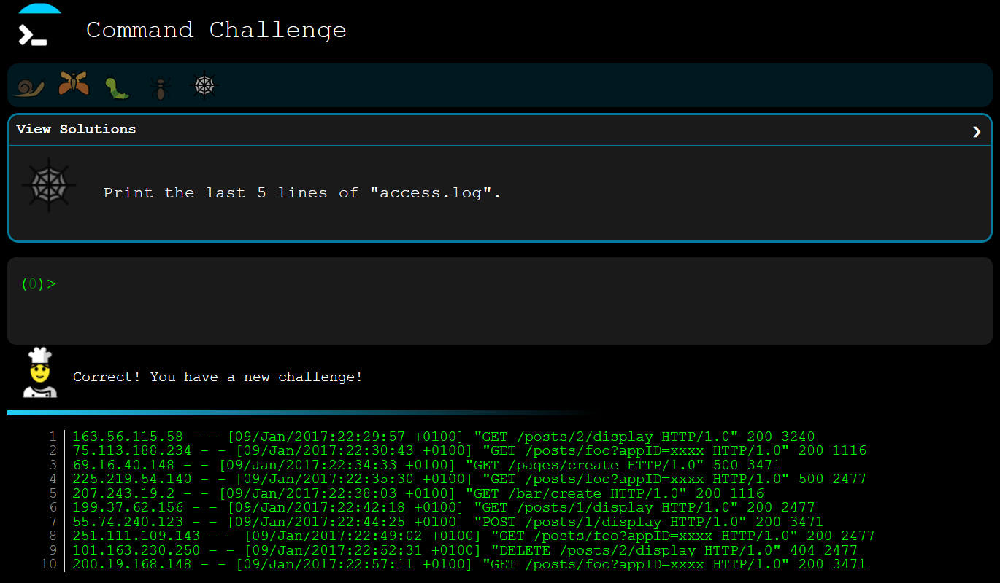

# `01-grading.md`

Screenshots are `01-xx-command.png` and `01-xx-response.png` in the `Images` folder.

---

## `hello_world/`

---

## `current_working_directory/`

---

## `list_files/`

---

## `print_file_contents/`

