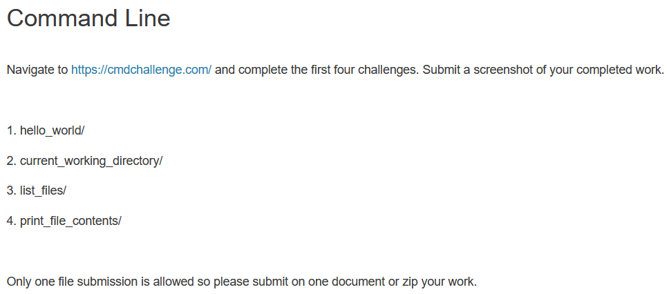

# `01-instructions.md`

---

Navigate to https://cmdchallenge.com/ and complete the first four challenges. Submit a screenshot of your completed work.

1. hello_world/
2. current_working_directory/
3. list_files
4. print_file_contents/

Only one file submissions is allowed, so please submit one document or zip your work.
