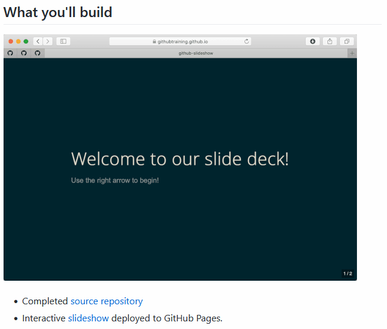
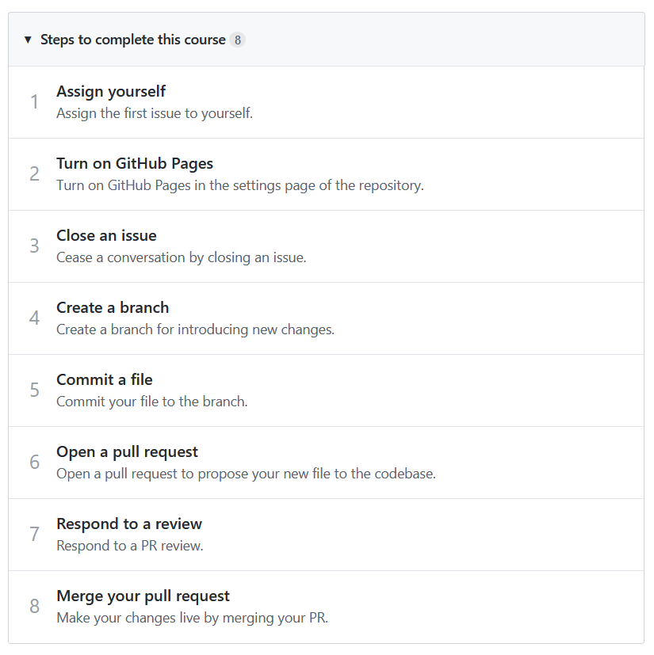

# `02-lab-instructions.md`

Take the [Introduction to GitHub course](https://lab.github.com/githubtraining/introduction-to-github) from GitHub Learning Lab and submit:

- Slideshow repo
- Deployed slideshow on GitHub Pages

There is a [course video](https://www.youtube.com/watch?v=sz6zfrQpCQg).

---

## Output

---

## Steps

