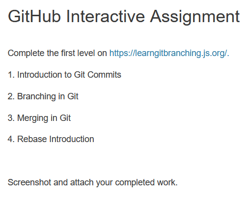

# `02-instructions.md`

---

Complete the first level on https://learngitbranching.js.org/.

1. Introduction to Git Commits
2. Branching in Git
3. Merging in Git
4. Rebase Introduction

Screenshot and attach your completed work.
