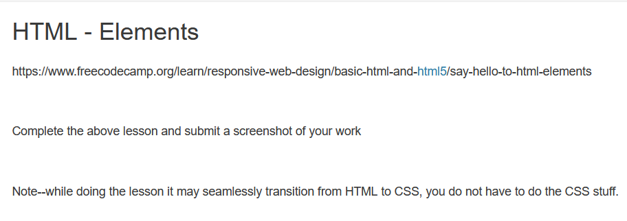

# `03.01-instructions.md`

## HTML - Elements

https://www.freecodecamp.org/learn/responsive-web-design/basic-html-and-html5/say-hello-to-html-elements

Complete the above lesson and submit a screenshot of your work

Note--while doing the lesson it may seamlessly transition from HTML to CSS, you do not have to do the CSS stuff.

---

